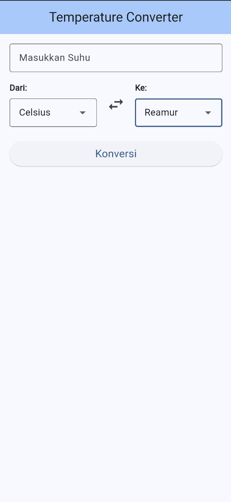
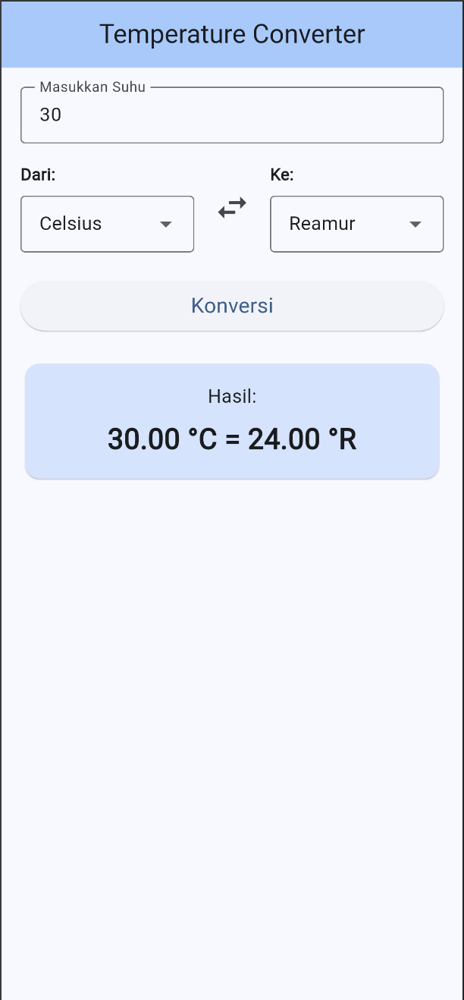

# Temperature Converter - Flutter App

## Identitas

|                 |                                         |
| --------------- | --------------------------------------- |
| **Nama**        | Maulana Chandra Irawan                  |
| **NRP**         | 3124521038                              |
| **Mata Kuliah** | Workshop Pemrograman Perangkat Bergerak |

---

## Deskripsi Aplikasi

Aplikasi konversi suhu yang dapat mengkonversi nilai suhu antar 4 satuan: **Celsius**, **Fahrenheit**, **Kelvin**, dan **Reamur**.

---

## Fitur Aplikasi

1. **Input Suhu** - Memasukkan nilai suhu yang akan dikonversi
2. **Pilih Satuan** - Memilih satuan asal dan tujuan dari dropdown
3. **Tombol Swap** - Menukar satuan asal dan tujuan dengan satu klik
4. **Tombol Konversi** - Menghitung dan menampilkan hasil
5. **Validasi Input** - Menampilkan pesan error jika input tidak valid

---

## Screenshot Aplikasi

|              Default               |         Hasil Konversi         |
| :--------------------------------: | :----------------------------: |
|  |  |

---

## Implementasi Kode

### 1. Enum TemperatureUnit

```dart
enum TemperatureUnit {
  celsius,
  fahrenheit,
  kelvin,
  reamur;

  String get symbol {
    return switch (this) {
      TemperatureUnit.celsius => '°C',
      TemperatureUnit.fahrenheit => '°F',
      TemperatureUnit.kelvin => 'K',
      TemperatureUnit.reamur => '°R',
    };
  }

  String get displayName {
    return switch (this) {
      TemperatureUnit.celsius => 'Celsius',
      TemperatureUnit.fahrenheit => 'Fahrenheit',
      TemperatureUnit.kelvin => 'Kelvin',
      TemperatureUnit.reamur => 'Reamur',
    };
  }
}
```

### 2. Fungsi Konversi Suhu

```dart
class TemperatureConverter {
  static double convert(double value, TemperatureUnit from, TemperatureUnit to) {
    if (from == to) return value;
    double celsius = _toCelsius(value, from);
    return _fromCelsius(celsius, to);
  }

  static double _toCelsius(double value, TemperatureUnit unit) {
    return switch (unit) {
      TemperatureUnit.celsius => value,
      TemperatureUnit.fahrenheit => (value - 32) * 5 / 9,
      TemperatureUnit.kelvin => value - 273.15,
      TemperatureUnit.reamur => value * 5 / 4,
    };
  }

  static double _fromCelsius(double celsius, TemperatureUnit unit) {
    return switch (unit) {
      TemperatureUnit.celsius => celsius,
      TemperatureUnit.fahrenheit => (celsius * 9 / 5) + 32,
      TemperatureUnit.kelvin => celsius + 273.15,
      TemperatureUnit.reamur => celsius * 4 / 5,
    };
  }
}
```

### 3. Widget Dropdown Satuan

```dart
class _UnitDropdown extends StatelessWidget {
  const _UnitDropdown({
    required this.label,
    required this.value,
    required this.onChanged,
  });

  final String label;
  final TemperatureUnit value;
  final ValueChanged<TemperatureUnit> onChanged;

  @override
  Widget build(BuildContext context) {
    return Column(
      crossAxisAlignment: CrossAxisAlignment.start,
      children: [
        Text(label, style: const TextStyle(fontWeight: FontWeight.bold)),
        const SizedBox(height: 8),
        DropdownButtonFormField<TemperatureUnit>(
          value: value,
          items: TemperatureUnit.values
              .map((unit) => DropdownMenuItem(
                    value: unit,
                    child: Text(unit.displayName),
                  ))
              .toList(),
          onChanged: (unit) {
            if (unit != null) onChanged(unit);
          },
        ),
      ],
    );
  }
}
```

### 4. Fungsi Swap Satuan

```dart
void _swapUnits() {
  setState(() {
    final temp = _fromUnit;
    _fromUnit = _toUnit;
    _toUnit = temp;
  });
}
```

---

## Rumus Konversi

| Dari       | Ke Celsius | Rumus          |
| ---------- | ---------- | -------------- |
| Celsius    | -          | C              |
| Fahrenheit | °C         | (F - 32) × 5/9 |
| Kelvin     | °C         | K - 273.15     |
| Reamur     | °C         | R × 5/4        |

| Dari Celsius | Ke         | Rumus          |
| ------------ | ---------- | -------------- |
| -            | Celsius    | C              |
| °C           | Fahrenheit | (C × 9/5) + 32 |
| °C           | Kelvin     | C + 273.15     |
| °C           | Reamur     | C × 4/5        |

---

## Struktur Proyek

```
temperatureconverter/
├── lib/
│   ├── main.dart                      # Entry point aplikasi
│   ├── my_app.dart                    # Widget utama dan UI
│   └── utils/
│       └── temperature_converter.dart # Logika konversi suhu
├── pubspec.yaml                       # Dependencies
└── ...
```

---

## Cara Menjalankan Aplikasi

1. Pastikan Flutter SDK sudah terinstall
2. Clone repository ini
3. Jalankan perintah:
   ```bash
   flutter pub get
   flutter run
   ```

---

## Teknologi yang Digunakan

- **Flutter** - Framework UI cross-platform
- **Dart** - Bahasa pemrograman
- **Material Design 3** - Design system
